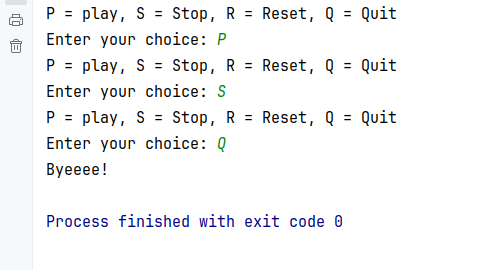

# Simple_Java_Sound_Audio_Player

Console based Java Sound Audio Player by using 'javax.sound.sampled' tutorial with Bro Code(https://www.youtube.com/watch?v=SyZQVJiARTQ).

#### How it appears and works on console:

User enter 'P', 'S', 'R' or 'Q' to play, stop, resume, quit the audio file 'Chimes_and_Bow.wav'.

Once the user enters 'Q', the audio stops and the program ends.